# CivicGrid Integration Guide

## 🚀 Quick Start

### Prerequisites
- Node.js 18+ and npm
- Python 3.8+
- API Keys:
  - **DEEPGRAM_API_KEY**: For voice agent (get from https://console.deepgram.com)
  - **ANTHROPIC_API_KEY**: For Claude analyzer (get from https://console.anthropic.com)

### Setup Steps

1. **Make scripts executable:**
```bash
chmod +x start-all-services.sh stop-all-services.sh
```

2. **Add API Keys:**
```bash
# Voice Agent Backend
echo "DEEPGRAM_API_KEY=your_key_here" >> ML-backend/voice-agent-backend/.env

# Claude Analyzer
echo "ANTHROPIC_API_KEY=your_key_here" >> ML-backend/Claude-Anaylzer/.env
```

3. **Start all services:**
```bash
./start-all-services.sh
```

4. **Access the application:**
- Frontend: http://localhost:5173
- Voice Agent Backend: http://localhost:3000

## 🏗️ Architecture Overview

### Components

1. **Frontend (React + TypeScript)**
   - Voice-based reporting interface
   - Real-time WebSocket connection to ML backend
   - Dashboard for government officials and contractors
   - Work items management

2. **Voice Agent Backend (Python + Flask)**
   - Deepgram STT/TTS integration
   - Google Gemini for conversation logic
   - WebSocket communication with frontend
   - Saves transcripts and uploads to cloud

3. **Claude Analyzer (Python)**
   - Processes transcripts + images
   - Generates structured JSON
   - Posts to Firebase database

4. **Firebase Backend**
   - Work items management
   - Status tracking
   - Contractor assignments

## 📋 Testing End-to-End Flow

### 1. Voice Reporting Flow
1. Navigate to http://localhost:5173/report
2. Click the phone button to start a voice call
3. Speak your issue clearly (e.g., "There's a large pothole on Main Street")
4. Upload a photo using the "Photo Evidence" section
5. Click the red phone button to end the call
6. System will:
   - Save transcript
   - Send to Claude for analysis
   - Create work item in database
   - Redirect to cases page

### 2. Government Dashboard Flow
1. Login as an official: http://localhost:5173/login
2. Navigate to Government Dashboard: http://localhost:5173/government/dashboard
3. View pending approval items
4. Assign contractors to work items
5. Approve/deny assignments
6. Verify completed work

### 3. Contractor Flow
1. Login as contractor
2. View assigned tasks in dashboard
3. Update status to "fixing"
4. Submit completion with photo evidence
5. Wait for government verification

## 🔧 Configuration

### Environment Variables

**Frontend (.env):**
```env
VITE_ML_BACKEND_URL=http://localhost:3000
VITE_GEOAPIFY_KEY=your_key_here
VITE_MAPTILER_KEY=your_key_here
```

**Voice Agent Backend (.env):**
```env
DEEPGRAM_API_KEY=your_key_here
GOOGLE_API_KEY=your_key_here  # For Gemini
```

**Claude Analyzer (.env):**
```env
ANTHROPIC_API_KEY=your_key_here
CLAUDE_MODEL=claude-3-5-sonnet-20241022
```

## 📊 API Endpoints

### Work Items Management

| Endpoint | Method | Description |
|----------|--------|-------------|
| `/updateProcessedUpload` | POST | Process analyzed upload |
| `/getAllWorkItems` | GET | Get all work items |
| `/assignWorkItemToContractor` | GET | Assign work to contractor |
| `/getPendingGovApprovalItems` | GET | Get items pending approval |
| `/getSelfReportedCompletedItems` | GET | Get completed items |
| `/updateGovApprovalStatus` | POST | Update approval status |
| `/updateStatusToFixing` | POST | Mark as in progress |
| `/submitFixedWork` | POST | Submit completion |

### Voice Agent

| Endpoint | Method | Description |
|----------|--------|-------------|
| `/` | WS | WebSocket connection |
| `/upload_picture` | POST | Upload image |
| `/transcript` | GET | Get current transcript |

## 🐛 Troubleshooting

### Common Issues

1. **Port already in use:**
```bash
./stop-all-services.sh
# OR manually:
kill -9 $(lsof -t -i:3000)
kill -9 $(lsof -t -i:5173)
```

2. **CORS errors:**
- Ensure Voice Agent Backend has CORS configured
- Check that ML_BACKEND_URL in frontend .env matches backend address

3. **Voice not working:**
- Check browser permissions for microphone
- Ensure DEEPGRAM_API_KEY is valid
- Check console for WebSocket errors

4. **Claude Analyzer not processing:**
- Verify ANTHROPIC_API_KEY is set
- Check Claude-Analyzer logs
- Ensure system_prompt.txt exists

## 📝 Development Workflow

### Running Services Individually

**Frontend:**
```bash
cd civicgrid
npm install
npm run dev
```

**Voice Agent Backend:**
```bash
cd ML-backend/voice-agent-backend
python3 -m venv venv
source venv/bin/activate
pip install -r requirements.txt
python app.py
```

**Claude Analyzer (triggered automatically):**
```bash
cd ML-backend/Claude-Anaylzer
python3 process_uploads.py
```

### Monitoring Logs

```bash
# Voice Agent logs
tail -f voice-agent.log

# Frontend logs
tail -f frontend.log

# Combined logs
tail -f voice-agent.log frontend.log
```

## 🔄 Data Flow

```mermaid
graph LR
    A[User Voice] --> B[Voice Agent Backend]
    B --> C[Transcript + Image]
    C --> D[Cloud Function]
    D --> E[Claude Analyzer]
    E --> F[Structured JSON]
    F --> G[Firebase Database]
    G --> H[Dashboards]
    H --> I[Government Review]
    I --> J[Contractor Assignment]
    J --> K[Work Completion]
```



## 📱 Key Features

### Implemented
- ✅ Voice-based issue reporting
- ✅ Real-time transcription
- ✅ Photo upload during call
- ✅ AI analysis with Claude
- ✅ Government dashboard
- ✅ Contractor management
- ✅ Work item tracking
- ✅ Status updates

### Testing Checklist
- [ ] Voice call initiates successfully
- [ ] Microphone captures audio
- [ ] Transcript appears in real-time
- [ ] Photo uploads during call
- [ ] Call ends and saves transcript
- [ ] Claude processes the upload
- [ ] Work item appears in dashboard
- [ ] Government can assign contractor
- [ ] Contractor can update status
- [ ] Completion verification works

## 🚀 Deployment Notes

For production deployment:
1. Update all API endpoints to production URLs
2. Configure HTTPS for all services
3. Set up proper authentication
4. Enable production CORS settings
5. Configure environment-specific .env files
6. Set up monitoring and logging
7. Configure auto-scaling for cloud functions

## 📞 Support

For issues or questions:
- Check browser console for errors
- Review service logs
- Verify all API keys are set
- Ensure all dependencies are installed
- Check network connectivity between services
